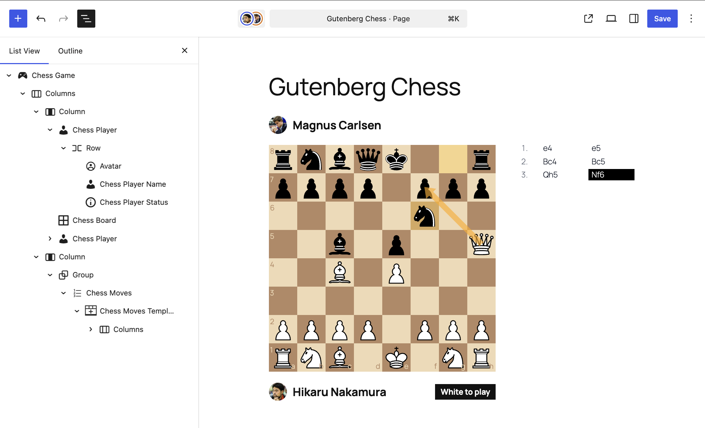

# Gutenberg Chess

Real-time collaborative chess blocks for WordPress.

This project is built for the WordPress 7.0 era, where collaboration is a first-class editing experience.
You can drop a chess game into the block editor, assign players, and let the board + move list stay in sync through block attributes and Gutenberg context.

It is a fun project hacked together as an experiment that became surprisingly usable.



## Why It Exists

WordPress collaboration features open the door to shared editing flows.
Chess is a perfect stress test:

- two users
- strict turn order
- stateful UI
- clean block composition

So this plugin turns that into a reusable block system instead of a one-off widget.

This plugin is intentionally composable.
The board, players, status labels, and move list are separate blocks, so admins can rearrange the layout directly in the editor.

## Architecture (Quick Tour)

At a high level:

- `chess-game` is the state owner (moves + selected players).
- state is propagated through Gutenberg block context.
- specialized child blocks render board, players, status, and move history.
- React (`chess.js` + `react-chessboard`) handles game rules and board UI.
- PHP dynamic rendering wires frontend mounts and context output.

Main folders:

- `src/blocks/*`: block definitions, editor behavior, view scripts, dynamic render templates.
- `src/contexts/*`: shared React context (`ChessGameContext`) and board/game state helpers.
- `src/components/*`: shared UI behavior (board rendering, move rows, perspective logic).
- `build/*`: compiled assets + block manifest.

## Block Overview

### `gutenberg-chess/chess-game`

- top-level wrapper and source of truth.
- stores:
  - `moves`
  - `whitePlayerId`
  - `blackPlayerId`
- provides block context to descendants.

### `gutenberg-chess/chess-board`

- renders the interactive board in editor.
- renders display-only board on frontend.
- supports:
  - restart toolbar action
  - board orientation by player perspective
  - last-move square highlight
  - turn-based interaction gating in editor

### `gutenberg-chess/chess-player`

- contextual player container for either white or black side.
- syncs nested player-related blocks with assigned user.

### `gutenberg-chess/chess-player-name`

- displays selected player name (styleable text block).

### `gutenberg-chess/chess-player-status`

- displays simple status text like whose turn it is, win state, or draw.
- hidden when no status should be shown.

### `gutenberg-chess/chess-moves`

- container block for the move list area.

### `gutenberg-chess/chess-moves-template`

- row template for moves.
- first row is editable; following rows are generated previews from context.

### `gutenberg-chess/chess-move-index`

- displays move number (`1.`, `2.`, ...).

### `gutenberg-chess/chess-move`

- displays SAN move text for white or black.
- highlights latest move entry.

## Collaboration Behavior

- moves are persisted in block attributes.
- in editor, only the player whose turn it is can move.
- if current user is the black player, editor board/player perspective flips.
- if white and black are the same user, no flip is applied.
- frontend board is intentionally read-only.

## Try It From a Release

1. Go to the repository **Releases** page.
2. Download the latest `gutenberg-chess.zip` asset.
3. In WordPress admin: **Plugins -> Add New -> Upload Plugin**.
4. Upload the zip and activate.
5. Create or edit a post/page and insert **Chess Game**.
6. Pick white/black players in inspector.
7. Open the same post in two editor sessions with different users and play.

## Release Automation

This repo includes a GitHub Action that:

- watches `gutenberg-chess.php`
- detects version header changes
- runs Composer + npm build
- creates a GitHub release tagged with the plugin version
- uploads the built plugin zip

So bumping `Version:` in `gutenberg-chess.php` is the release trigger.

## Local Dev

```bash
composer install
npm ci --legacy-peer-deps
npm run build
```

`--legacy-peer-deps` is required because `react-chessboard` currently targets React 19, while Gutenberg still runs on React 18.

For watch mode:

```bash
npm run start
```
